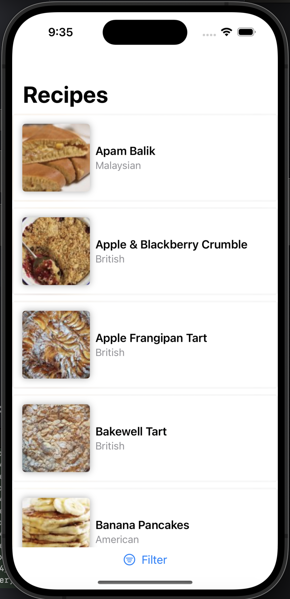
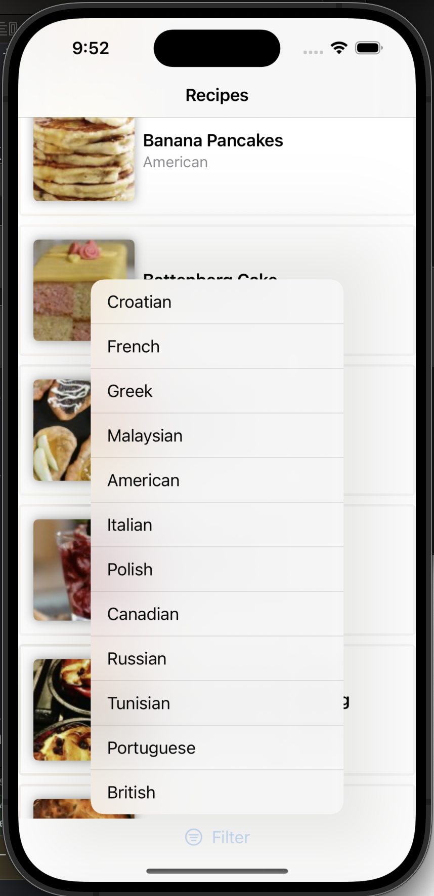

### Summary: Include screen shots or a video of your app highlighting its features

The app just start will load all resources, one resources are loaded next time will be faster because some images will be stored in cache. Keep touch as long press and the full size image is shown as modal. ( requirement for the app is single view, for me is not considered a navigation, its just same page and modern way to see detail).
    The pull to refresh gesture will clear any selected cuisine type and load data again. At the bottom of the app theres a simple menu to filterout on cuisine type. Clearing selection is performed with the aforehead mentioned pull to refresh gesture. 

### Focus Areas: What specific areas of the project did you prioritize? Why did you choose to focus on these areas?

 - I Gave priority to performance, network and caching are high priority for me due to the fact that UI relies on this layer quality. I designed quite simple making use of modern async API wich is a huge lap on networking.

### Time Spent:
Mon,Jan 13, 10:52 
Approximately how long did you spend working on this project? How did you allocate your time?
I made during weekend of Jan 10,11 some hours each day. Then alternating when finish my current job a couple of hours after work, maybe sum all hours would be about 2.5 days ? aprox.

### Trade-offs and Decisions: Did you make any significant trade-offs in your approach?

    -  I used my own implementation instead of **AsyncImage** for displaying images. (theres two branch on for downlading images using just an image and playing with async and task modifiers and other created a component **CachedAsyncImage**) Though that its a great oportunity to showcase and test different approach that allows to finetune and open posibilities to create a component. Using our caching system
    
### Weakest Part of the Project: What do you think is the weakest part of your project?
    - Probably the test, i would like to have more time ( we all say the same everytime), and also its a challenge understand the design that Apple declare to use for swiftData modelcontext. I didnt find a correct approach that VM make use of it. 

### Additional Information: Is there anything else we should know? Feel free to share any insights or constraints you encountered.

 - I would like to mention the use of a **DI** ( not my own creation ) in the article by Antoine van der Lee. Its a great component and i got inspired by the idea under the requirement that not 3rd party library https://www.avanderlee.com/swift/dependency-injection/ . It use property wrapers in all of their concept.
